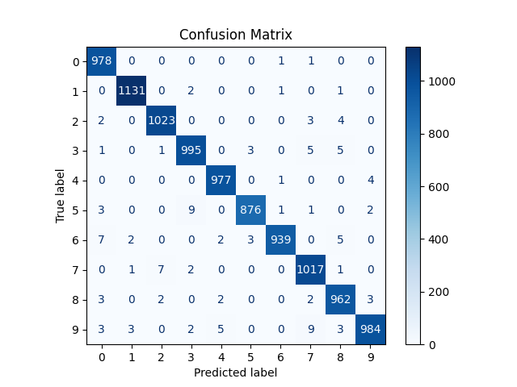
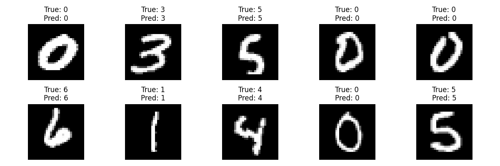
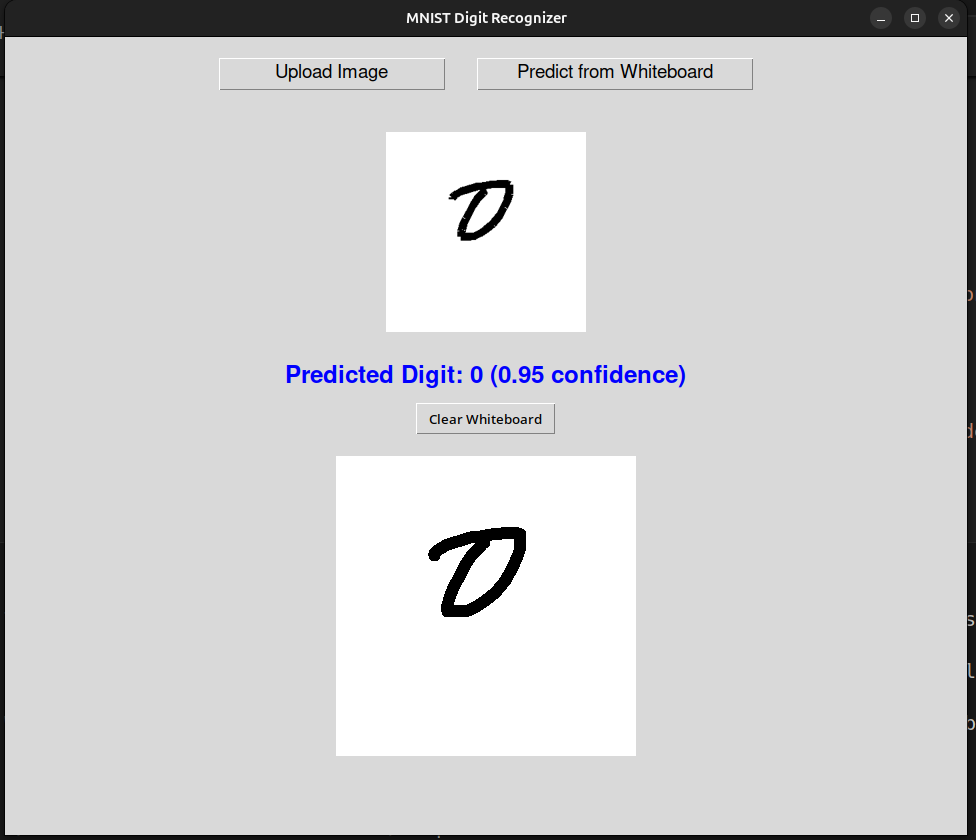

# 🖊️ Handwritten Digit Recognition using CNN and Tkinter GUI

## 🎯 Objective
To build a machine learning application capable of recognizing handwritten digits (0–9) using a trained Convolutional Neural Network (CNN) and provide real-time predictions via a simple graphical interface.

---

## 📁 Project Components

- **Model Training** using CNN and MNIST dataset
- **Tkinter GUI** with canvas for drawing
- **Image Upload & Real-Time Prediction**
- **Visualization**: Confusion matrix, training accuracy/loss curves

---

## 🧠 Model Architecture

- **Input Layer**: 28x28 grayscale images
- **Convolution Layers**:
  - `Conv2D(32, 3x3)` + ReLU + MaxPooling
  - `Conv2D(64, 3x3)` + ReLU + MaxPooling
- **Fully Connected Layers**:
  - `Dense(128)` + ReLU + `Dropout(0.5)`
  - `Dense(10)` + Softmax (for classification)

---

## 📊 Model Evaluation

- **Dataset**: MNIST (60,000 train + 10,000 test images)
- **Accuracy**:
  - ~99% on training data
  - ~98.5% on testing data
- **Visualization**:
  - Confusion matrix
  - Training vs Validation Accuracy and Loss

---

## 🖥️ GUI Features (Tkinter)

- **Whiteboard**: Draw digits with your mouse
- **Upload Image**: Use external digit images (JPG, PNG)
- **Predict Button**: Instantly predicts drawn/uploaded digit
- **Clear Canvas**: Reset the drawing area
- **Save Canvas**: Save your digit as an image(available in singlr filed script)
- **Displays**:
  - Predicted digit
  - Confidence score

---

## 🧹 Preprocessing Pipeline

1. Invert colors (white on black)
2. Apply thresholding
3. Crop bounding box around digit
4. Resize to 20x20
5. Pad to 28x28 to match MNIST format
6. Normalize pixel values
7. Reshape for CNN input

## 📸 Screenshots

### 1. Confusion Matrix


### 2. Sample Predictions


### UI Output


## 🧪 Sample Prediction Output

```plaintext
Predicted Digit: 4 (Confidence: 0.98)
```
---

# 🔧 Setup Instructions
## 1. Install Dependencies

```bash
    pip install tensorflow keras numpy opencv-python pillow matplotlib scikit-learn

```

## 2. Run the Model (Optional)
```bash
python PredictDigitModel.py
```
- This will generate mnist_cnn_model.h5.

## 3. Launch the GUI App

```bash 
python app.py
```

- 📦 Files Structure

```bash 

Handwritten_Digit_Recognition/
│
├── app.py                     # Main Tkinter GUI script
├── whiteboard.py              # Whiteboard drawing logic
├── utils.py                   # Utility functions for preprocessing
├── PredictDigitModel.py       # Model prediction functions
├── SingleFiledScript.py       # Alternate version (optional)
│
├── models/
│   └── mnist_cnn_model.h5     # Pre-trained CNN model (basic version)
│
├── updatedmodel_stuff/
│   ├── modelfile_updated.py   # Updated training script
│   └── mnist_digit_classifier/
│       ├── mnist_cnn_model.h5       # Updated trained model
│       ├── mnist_model.tflite       # TFLite converted model
│       ├── confusion_matrix.png     # Evaluation result
│       ├── training_history.png     # Accuracy/Loss plots
│       └── sample_predictions.png   # Sample results
│
├── tests_images/              # Folder for user image testing
├── Readme.md                  # You're reading it!
└── __pycache__/               # Python bytecode cache
```


## Future Improvements

  - Sound alerts or popup for predictions
  - Add digit smoothing or cleanup for rough inputs
  - Extend to web or mobile platforms
  - Allow retraining with user-drawn digits
  - Dark mode or color options for canvas

## License

- MIT License - free to use and modify.

## 🙌 Credits

- Developed by Chandu Chitteti
- Inspired by the MNIST digit classification challenge.
