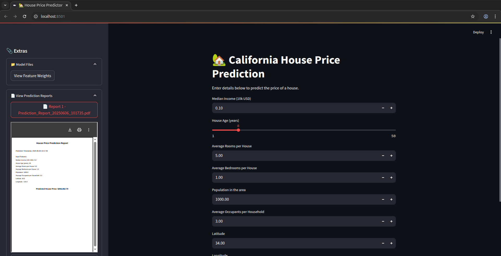

# 🏡 California House Price Prediction

This project is developed as part of the **CloudCredits ML & AI Internship**. It predicts median house prices in California using the California Housing dataset from `sklearn.datasets`.

We use **Linear Regression with Polynomial Features** to model the data. The application includes a **Streamlit-based UI** where users can input house-related features and receive real-time price predictions, along with downloadable PDF reports.

---

## 🎯 Features

- ✔️ Linear Regression with Polynomial Feature Expansion
- ✔️ Log-transformation of target variable for stability
- ✔️ `StandardScaler` normalization
- ✔️ Diagnostic plots: Actual vs Predicted, Residual Histogram
- ✔️ Streamlit UI for prediction and report generation
- ✔️ PDF export of predictions
- ✔️ Logging and modular pipeline design

---

## 📂 Project Structure

```bash
HousePricePrediction
├── train_model.py # Trains and saves the model
├── ui_app.py # Streamlit app for predictions
├── model/
│ ├── house_model.pkl
│ ├── scaler.pkl
│ ├── poly_transformer.pkl
│ └── predictions/ # Saved PDF reports
├── reports/
│ ├── actual_vs_pred.png
│ └── residual_hist.png
├── UI_output.png # Screenshot of UI
└── README.md
```

---

## 🖥️ Output

### Streamlit UI Example:



---

## 🔧 How to use

1. **Train the model** (if not already trained):
   ```bash
   python train_model.py
   ```

    Launch the prediction UI:

    ```bash

    streamlit run ui_app.py
    ```

2.  **Interact with the app**

       -  Fill in feature inputs like median income, house age, location, etc.

       -  View the predicted price.

       -  Saved a PDF report.

       -  View past predictions from the sidebar.

3. **Model Improvements and Results**

We applied several improvements to enhance the efficiency and accuracy of the model:

  - Split raw data before preprocessing.

  - Polynomial features are created and scaled.

  - Target is log-transformed during training (log1p).

  - During evaluation, predictions are inverse-transformed using expm1.

  - The PolynomialFeatures transformer is saved alongside the model and scaler.

  - Diagnostic plots illustrate:

      - Actual vs Predicted values

      - Residual distribution

  - Logging provides clear progress tracking and error reporting.

## 📊 Results:

  - Mean Squared Error (MSE): 0.4536 — significantly improved from previous 0.5559.

  - R² Score: 0.6539 — improved from about 0.5758, now explaining ~65% of the variance.

I believe these results are decent for a basic linear regression approach with polynomial expansion, especially considering the simplicity of the model.

## 📌 Conclusion

This project demonstrates how classic machine learning methods—when combined with proper preprocessing, transformations, and a clean interface—can be used effectively for real-world prediction tasks.

While the model performs fairly well, future improvements can include:

  - Trying other regressors like Ridge, Lasso, or Gradient Boosting

  - Feature engineering and selection

  - Cross-validation and hyperparameter tuning