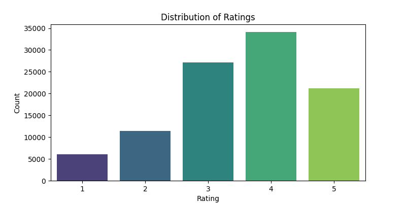
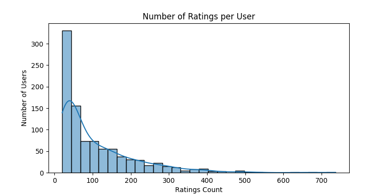
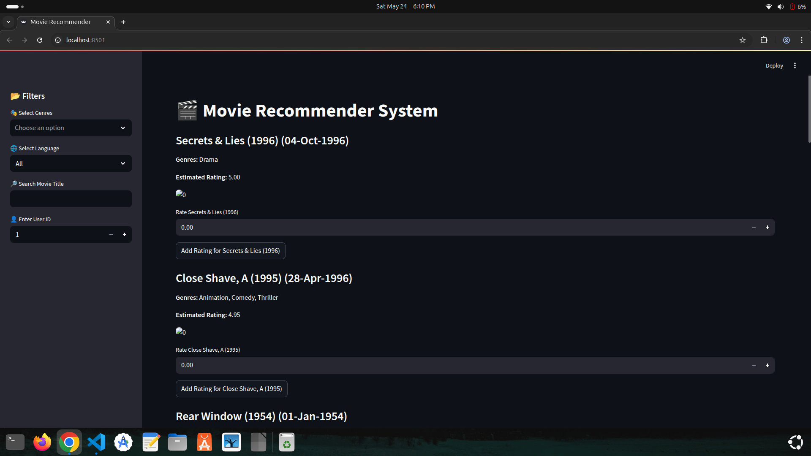

# Movie Recommender System

A Python-based movie recommendation system using the **Surprise** library's SVD algorithm.  
Includes exploratory data analysis (EDA) and a Streamlit web app interface for interactive movie recommendations with genre, language, and title filtering.

---

## Features

- Loads and processes MovieLens dataset (`u.data` and `u.item`).
- Exploratory Data Analysis (EDA) with visualizations of ratings distribution and user rating counts.
- Trains or loads an SVD collaborative filtering model for recommendations.
- Provides top-N personalized movie recommendations for any user.
- Interactive Streamlit app for filtering by genres, language, and searching movie titles.
- Allows users to add new ratings (updates dataset in-memory, no retraining).
- Saves and loads trained models with pickle.

---

## Project Structure

- `data/` — contains MovieLens dataset files `u.data` and `u.item`.
- `svd_model.pkl` — saved SVD model file after training.
- `ratings_distribution.png`, `ratings_per_user.png` — generated EDA plots.
- `movie_recommender.py` — main Python code with `MovieRecommender` class and CLI usage.
- `app.py` — Streamlit web app for interactive recommendations.

---

## Dependencies

- Python 3.x  
- pandas  
- matplotlib  
- seaborn  
- scikit-surprise (`surprise`)  
- streamlit

Install dependencies with:

```bash
pip install pandas matplotlib seaborn scikit-surprise streamlit

```

# Usage
- Running the recommender from command line

- python movie_recommender.py

    - Loads data from data/ directory.

    - Trains the SVD model if not already saved.

    - Performs EDA and saves plots (ratings_distribution.png, ratings_per_user.png).

    - Prints top 10 movie recommendations for user ID 50.

# Using the Streamlit Web App
``` bash
 streamlit run app.py
 ```

- Provides filters in the sidebar for genres, language, and movie title search.

- Input user ID to get personalized movie recommendations.

- Shows movie titles, release dates, genres, estimated ratings, and placeholder posters.

- Allows users to rate movies, adding ratings dynamically.

# Code Overview
- MovieRecommender Class

    - Initialization: Loads data and trains or loads the SVD model.

    - load_data(): Reads MovieLens ratings (u.data) and movie info (u.item) with genres.

    - eda(): Generates and saves plots for ratings distribution and number of ratings per user.

    - train_or_load_model(): Loads existing model or trains new SVD model on the ratings data.

    - recommend_movies(user_id, top_n=10): Recommends top-N movies for the given user based on predicted ratings.

    - add_rating(user_id, movie_id, rating): Adds a new rating to the dataset (no retraining).

# Notes

- The movie posters in the Streamlit app are placeholders (https://via.placeholder.com/100x150?text=Movie).

- Ratings are stored in memory during runtime; new ratings won't persist unless saved externally.

- The dataset uses the MovieLens 100K data format.

- The language column is simulated as "English" for demonstration purposes.

- Model is saved as svd_model.pkl after training to avoid retraining on every run.

# Sample Output

``` bash 
Loaded 100000 ratings and 1682 movies.
Loading model from svd_model.pkl ...
Performing exploratory data analysis...

Top 10 movie recommendations for user 50:
1. Wrong Trousers, The (1993) - Predicted Rating: 4.81
2. Star Wars (1977) - Predicted Rating: 4.72
3. Raiders of the Lost Ark (1981) - Predicted Rating: 4.68
4. Close Shave, A (1995) - Predicted Rating: 4.65
5. North by Northwest (1959) - Predicted Rating: 4.62
6. Shawshank Redemption, The (1994) - Predicted Rating: 4.61
7. Casablanca (1942) - Predicted Rating: 4.58
8. Return of the Jedi (1983) - Predicted Rating: 4.53
9. Sunset Blvd. (1950) - Predicted Rating: 4.52
10. Lawrence of Arabia (1962) - Predicted Rating: 4.50
...

```

## 📸 Screenshots

### 1. Ratings Distribution


### 2. Ratings Per User


### UI Output


# Further Actions
- Providing movies based on specific user(using user_id)
